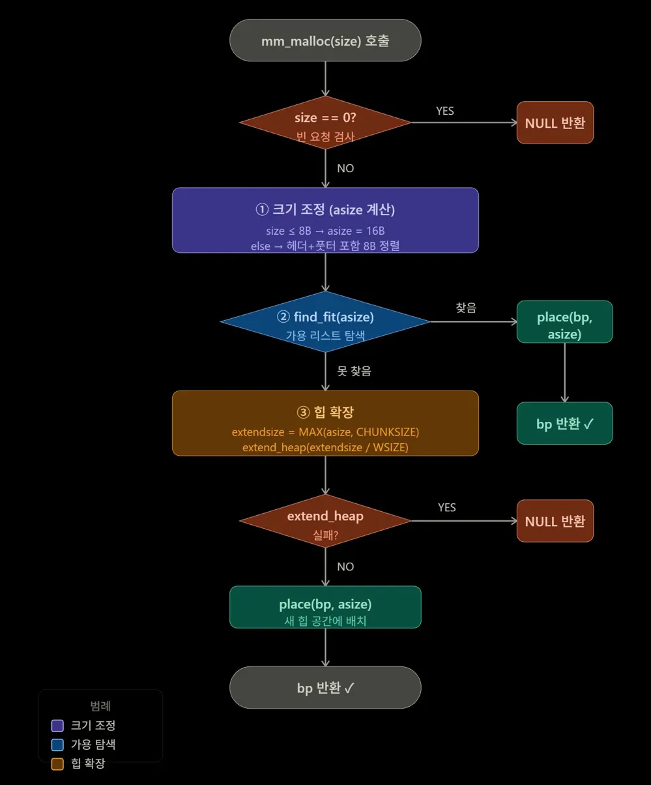

# `mm_malloc()` — 힙 메모리 할당 함수

---

## 함수 코드

```c
void *mm_malloc(size_t size) {
    size_t asize;       // 조정된 블록 크기
    size_t extendsize;  // 힙 확장 크기
    char *bp;

    if (size == 0) return NULL;

    // ① 크기 조정 (헤더+풋터 포함, 8B 정렬)
    if (size <= DSIZE)
        asize = 2 * DSIZE;                              // 최소 16B
    else
        asize = DSIZE * ((size + DSIZE + (DSIZE-1)) / DSIZE);

    // ② 가용 리스트에서 탐색
    if ((bp = find_fit(asize)) != NULL) {
        place(bp, asize);
        return bp;
    }

    // ③ 못 찾으면 힙 확장
    extendsize = MAX(asize, CHUNKSIZE);
    if ((bp = extend_heap(extendsize/WSIZE)) == NULL)
        return NULL;
    place(bp, asize);
    return bp;
}
```

---

## 역할 요약

`mm_malloc()`은 사용자가 요청한 크기만큼의 힙 메모리를 할당해 반환하는 함수입니다.
핵심 역할은 딱 두 가지입니다.

1. **요청 크기 조정** — 헤더/풋터 포함, 8바이트 정렬 맞추기
2. **가용 블록 확보** — 기존 가용 리스트 탐색 후 없으면 힙 확장

---

## 힙 할당 레이아웃 (낮은 주소 → 높은 주소)

```
┌────────┬────────┬──────────────────────────┬──── ... ────┬────────┐
│ 패딩   │ 프롤H  │       할당된 블록         │  가용 블록  │ 에필H  │
│  4B    │PACK8,1 │ 헤더 │ 페이로드 │ 풋터   │             │PACK0,1 │
│        │        │alloc=1│  asize  │alloc=1 │  alloc=0    │        │
└────────┴────────┴──────────────────────────┴──── ... ────┴────────┘
                          ↑
                       bp 반환 (페이로드 시작)
```

> `asize` = 헤더(4B) + 실제 데이터 + 풋터(4B), 8B 정렬 보장

---

## 단계별 실행 과정



### Step 1 — `size == 0` 검사

```c
if (size == 0) return NULL;
```

- 크기가 0인 요청은 의미가 없으므로 즉시 `NULL`을 반환합니다.

```
size == 0 ?
    YES → return NULL
    NO  → Step 2로
```

---

### Step 2 — `asize` 계산 : 크기 조정

```c
if (size <= DSIZE)
    asize = 2 * DSIZE;
else
    asize = DSIZE * ((size + DSIZE + (DSIZE-1)) / DSIZE);
```

사용자가 요청한 `size`에 **헤더(4B) + 풋터(4B)** 를 더하고 **8바이트 정렬**을 맞춥니다.

#### size ≤ 8B 인 경우

```
아무리 작은 요청도 최소 16B 보장

  헤더(4B) + 데이터(최소 8B) + 풋터(4B) = 16B
  → asize = 2 × DSIZE = 16B
```

#### size > 8B 인 경우

```
asize = 8 × ⌈(size + 8) / 8⌉

예시 1: size = 13
  (13 + 8 + 7) / 8 = 28 / 8 = 3  (정수 나눗셈)
  asize = 8 × 3 = 24B  ✓

예시 2: size = 24
  (24 + 8 + 7) / 8 = 39 / 8 = 4
  asize = 8 × 4 = 32B  ✓
```

| 요청 size | 계산 과정 | asize | 8B 정렬 |
|-----------|-----------|-------|---------|
| 1B | `size ≤ 8` → 최소값 | 16B | ✓ |
| 8B | `size ≤ 8` → 최소값 | 16B | ✓ |
| 13B | `(13+8+7)/8=3` → `8×3` | 24B | ✓ |
| 24B | `(24+8+7)/8=4` → `8×4` | 32B | ✓ |
| 100B | `(100+8+7)/8=14` → `8×14` | 112B | ✓ |

---

### Step 3 — `find_fit(asize)` : 가용 리스트 탐색

```c
if ((bp = find_fit(asize)) != NULL) {
    place(bp, asize);
    return bp;
}
```

- 힙의 가용 블록 중 `asize` 이상인 블록을 탐색합니다.
- **찾은 경우** → `place()`로 블록 배치 후 `bp` 반환
- **못 찾은 경우** → Step 4로

```
가용 리스트 탐색 (first-fit 기준, asize=24 예시)

┌──────────┬──────────┬──────────┬──────────┐
│ 블록A    │ 블록B    │ 블록C    │ 블록D    │
│ alloc=1  │ alloc=0  │ alloc=0  │ alloc=0  │
│  32B     │  16B     │  64B     │  24B     │
└──────────┴──────────┴──────────┴──────────┘
               ↑            ↑
          16 < 24       64 ≥ 24
           skip         → 선택!  bp = 블록C
```

---

### Step 4 — `extend_heap()` : 힙 확장 후 배치

```c
extendsize = MAX(asize, CHUNKSIZE);
if ((bp = extend_heap(extendsize/WSIZE)) == NULL)
    return NULL;
place(bp, asize);
return bp;
```

- `extendsize = MAX(asize, CHUNKSIZE)` — 너무 잦은 확장을 막기 위해 최소 `CHUNKSIZE(4KB)` 확보
- 확장 실패 시 `NULL` 반환, 성공 시 `place()` 후 `bp` 반환

```
extendsize 결정 기준

  asize = 24B,   CHUNKSIZE = 4096B
  → MAX(24, 4096) = 4096B 확장  (작은 요청도 4KB씩 확보)

  asize = 8192B, CHUNKSIZE = 4096B
  → MAX(8192, 4096) = 8192B 확장  (요청이 더 크면 그만큼)
```

```
힙 확장 후 place(bp, asize=24) 동작

확장 직후 (새 가용 블록 4096B)
┌─────── ... ───┬──────────────────────────────┬────────┐
│   기존 블록들  │      새 가용 블록 (4096B)    │ 에필H  │
└─────── ... ───┴──────────────────────────────┴────────┘
                ↑ bp

place() 후 (분할 발생)
┌─────── ... ───┬──────────┬───────────────────┬────────┐
│   기존 블록들  │ 할당블록 │   남은 가용 블록  │ 에필H  │
│               │  24B     │      4072B        │        │
│               │ alloc=1  │     alloc=0       │        │
└─────── ... ───┴──────────┴───────────────────┴────────┘
                ↑ bp 반환
```

---

## `place()` 동작 원리

블록을 배치할 때 **남은 공간이 최소 블록 크기(16B) 이상이면 분할**합니다.

```
분할하는 경우 (남은 공간 ≥ 16B)

Before:
┌──────────────────────────────────┐
│         가용 블록 (64B)          │
│           alloc=0                │
└──────────────────────────────────┘

After: place(bp, asize=24)
┌──────────────┬───────────────────┐
│  할당 블록   │    가용 블록      │
│    24B       │      40B          │
│  alloc=1     │    alloc=0        │
└──────────────┴───────────────────┘
↑ bp 반환


분할 안 하는 경우 (남은 공간 < 16B)

Before:
┌──────────────────┐
│   가용 블록(24B) │
│    alloc=0       │
└──────────────────┘

After: place(bp, asize=24)
┌──────────────────┐
│   할당 블록(24B) │
│    alloc=1       │
└──────────────────┘
↑ bp 반환 (분할 없이 통째로 할당)
```

---

## 요약

```
mm_malloc(size)
  ├─ 0. size == 0?          → NULL 반환
  ├─ 1. asize 계산          → 헤더+풋터 포함, 8B 정렬
  ├─ 2. find_fit(asize)     → 가용 리스트 탐색
  │      └─ 찾음            → place() 후 bp 반환  ✓
  └─ 3. extend_heap()       → 힙 확장
         ├─ 실패            → NULL 반환
         └─ 성공            → place() 후 bp 반환  ✓
```